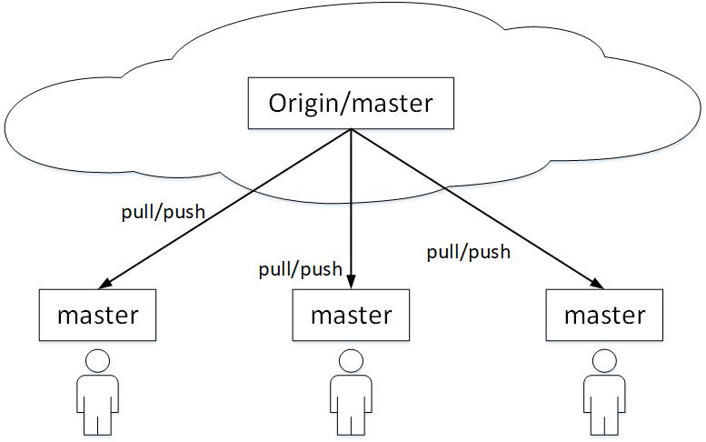
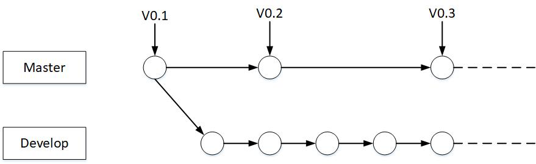
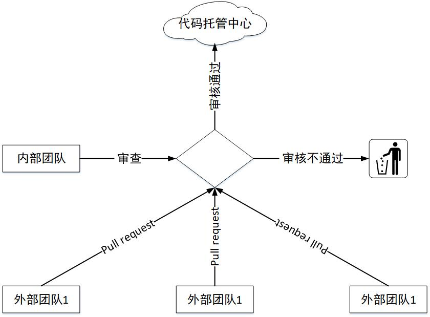
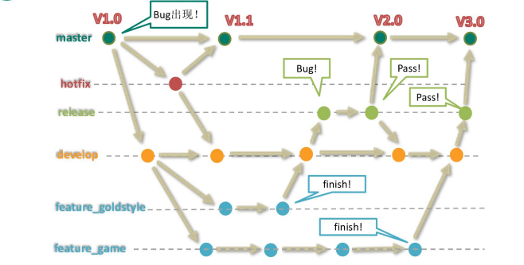

# Git 工作流

### 一 概念

在项目开发过程中使用 Git 的方式

### 二 分类

#### 1 集中式工作流

像 SVN 一样，集中式工作流以中央仓库作为项目所有修改的单点实体。所有修改都提交到 Master 这个分支上。这种方式与 SVN 的主要区别就是开发人员有本地库。Git 很多特性并没有用到。

#### 2 GitFlow 工作流

Gitflow 工作流通过为功能开发、发布准备和维护设立了独立的分支，让发布迭代过程更流畅。严格的分支模型也为大型项目提供了一些非常必要的结构。

#### 3 Forking 工作流

Forking 工作流是在 GitFlow 基础上，充分利用了 Git 的 Fork 和 pull request 的功能以达到代码审核的目的。更适合安全可靠地管理大团队的开发者，而且能接受不信任贡献者的提交。

### 三 GitFlow 工作流详解

#### 1 分支种类

* master     主干分支

  主要负责管理正在运行的生产环境代码。永远保持与正在运行的生产环境完全一致。

* develop    开发分支

  主要负责管理正在开发过程中的代码。一般情况下应该是最新的代码。

* hotfix    bug处理分支

  主要负责管理生产环境下出现的紧急修复的代码。 从主干分支分出，修理完毕并测试上线后，并回主干分支。并回后，视情况可以删除该分支。

* release    准生产分支（预发布分支）

  较大的版本上线前，会从开发分支中分出准生产分支，进行最后阶段的集成测试。该版本上线后，会合并到主干分支。生产环境运行一段阶段较稳定后可以视情况删除。

* feature    功能分支

  为了不影响较短周期的开发工作，一般把中长期开发模块，会从开发分支中独立出来。 开发完成后会合并到开发分支。

#### 2 GitFlow 工作流举例

#### 3 分支实战

* 用户1 创建 master 分支及 develop 分支，并提交至代码托管中心
* 用户2 从代码托管中心拉取最新代码
* 用户2 将合并 develop 至 master 分支，并提交至代码托管中心