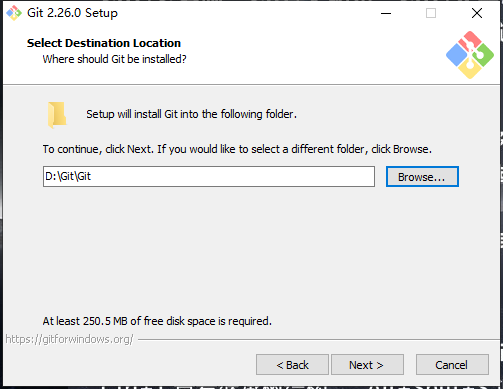
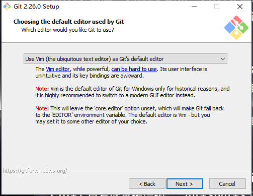

# 安装

## 1 下载地址

<https://git-scm.com/>

## 2 安装

### Step 1：GNU 协议

### Step 2：安装位置

在安装所有软件时，我们都应该尽量保证安装路径不包含 **中文、空格** 。

### Step 3：组件选择

### Step 4：设置开始菜单文件夹

### Step 5：选择默认编辑器

### Step 6：环境变量配置

### Step 7：HTTPS 协议设置

### Step 8：行末转换配置

### Step 9：Git Bash 终端

### Step 10：其它配置

### Step 11：完成

