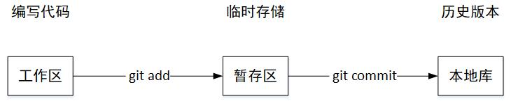
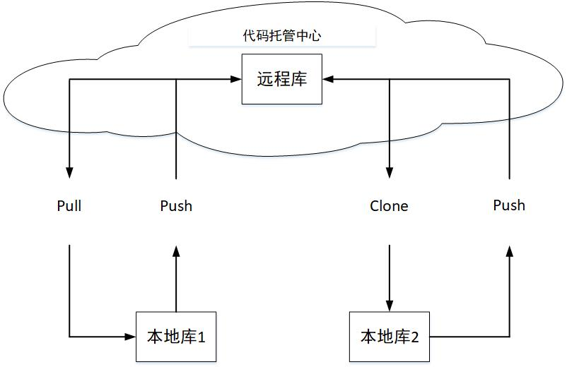
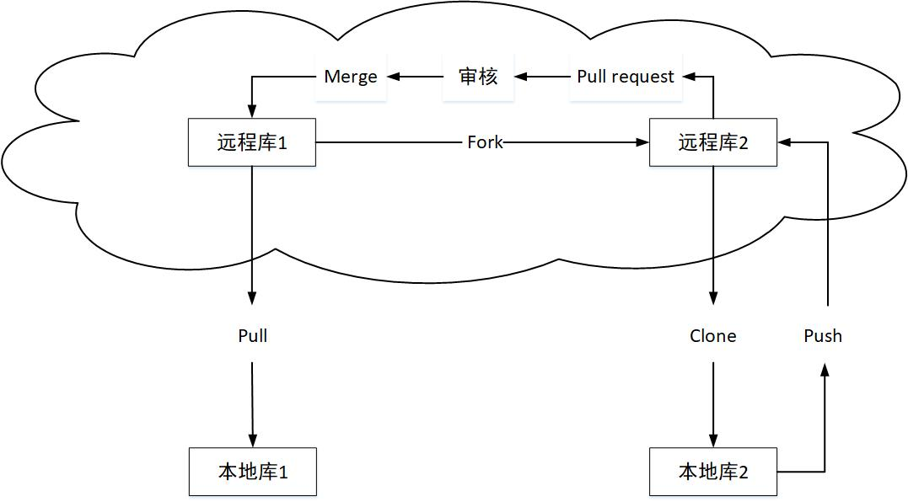

# Git 简介

### 1 Git 简史

Lunix 系统版本控制历史

1991 年：Linus 本人手动合并代码

2002 年：商业软件 BitKeeper 的东家 BitMover 公司出于人道主义精神，授权 Linux 社区免费使用这个版本控制系统，但要求不能进行破解

2005 年：开发 Samba 的 Andrew 试图破解 BitKeeper 的协议，被 BitMove 公司发现，要收回 Linux 社区的免费是使用权。（Linux 社区无法像商业公司那样对参与开发者进行强有力的约束）

2005 年：Linus 自己用 C 语言开发了一个分布式版本控制系统 Git。主体程序开发只用了两周，一个月后 Linux 系统代码由 Git 管理

2008 年：GitHub 社区上线
### 2 Git 官网和 Logo
官网地址	<https://git-scm.com/>

Logo

### 3 Git 的优势
- 大部分操作在本地完成，不需要联网
- 完整性保证
- 尽可能添加数据而不是删除或修改数据
- 分支操作非常快捷流畅
- 与 Linux 命令全面兼容

### 4 Git 结构

### 5 Git 和 代码托管中心

代码托管中心：维护远程仓库

- 局域网环境
  - GitLab
- 外网环境
  - GitHub
  - Gitee

### 6 本地库和远程库

#### 团队内部协作

#### 跨团队协作

