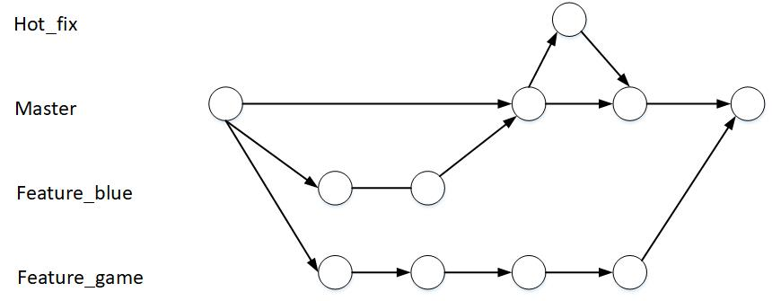
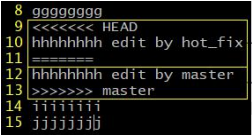

# Git 命令行操作

### 1 本地库初始化

```
git init
```

执行后生生成一个隐藏文件夹 .git ，该目录存放的是本地库相关的子目录和文件，不要删除，也不要胡乱修改

### 2 设置签名

作用：区分不同开发人员的身份

辨析：这里设置的签名和登录远程仓库（代码托管中心）的账号、密码没有任何关系。

**项目/仓库级别**

仅在当前本地库范围内有效，信息保存位置：.git/config 文件

````
git config user.name molln
git config user.email molln@molln.com

````

**系统用户级别**

登录当前操作系统的用户范围，信息保存位置：用户根目录/.gitconfig 文件

````
git config --global user.name molln
git config --global user.email molln@molln.com
````

#### 2.3 优先级

就近原则：项目级别优先于系统用户级别，二者都有时采用项目级别的签名

如果只有系统用户级别的签名，就以系统用户级别的签名为准

二者都没有不允许

### 3 基本操作

#### 3.1 状态查看

````
git status
````

查看工作区，暂存区状态

#### 3.2 添加

````
git add [filename]
````

将工作区的 **新建/修改** 提交至暂存区

#### 3.3 提交

````
git commit -m "First Commit" [filename]
````

将暂存区的内容提交到本地库

#### 3.4 查看历史记录

```
git log
```

```
git log --pretty=oneline
```

````
git log --oneline
````

````
git reflog
````

HEAD@{移动到当前版本需要多少步}

#### 3.5 前进后退

本质：移动 HEAD 指针

**基于索引值操作[推荐]**

````
git reset --hard [局部索引值]
````

**使用 ^ 符号：只能后退**

````java
git reset --hard HEAD^
````

一个^表示后退一步，n 个表示后退 n 步

**使用 ~ 符号：只能后退**

````java
git reset --hard HEAD~N
````

表示后退 n 步

#### 3.6 reset 命令的三个参数对比

**--soft**

在本地库移动HEAD指针

**--mixed**

在本地库移动HEAD指针

重置暂存区

**--hard**

在本地库移动HEAD指针

重置暂存区

重置工作区

#### 3.7 删除文件并找回

前提：删除前，文件存在时的状态提交到了本地库

操作：git reset --hard [指针位置]

* 删除操作已提交至本地库：指针位置指向历史记录
* 删除操作未提交至本地库：指针位置使用 HEAD

#### 3.8 比较文件差异

`git diff [文件名]`

将工作区中的文件和暂存区进行比较

`git diff [本地库历史版本] [文件名]`

将工作区中的文件和本地库历史记录比较

不带文件名，比较多个文件

### 4 分支管理

#### 4.1 什么是分支

在版本控制过程中，使用多条线同时推进多个任务



#### 4.2 分支的好处

同时并行推进多个功能开发，提高开发效率

各个分支在开发过程中，如果某一分支开发失败，不会对其它分支有任何影响。失败的分支删除重新开始即可。

#### 4.3 分支操作

##### （1）创建分支

````
git branch [分支名]
````

##### （2）查看分支

````
git branch -v
````

##### （3）切换分支

````
git checkout [分支名]
````

##### （4）合并分支

第一步：切换到接收修改的分支

````
git checkout [接收修改的分支]
````

第一步：执行 merge 命令

````
git merge [有修改的分支]
````

##### （5）解决冲突

冲突表现



冲突解决

* 编辑文件，删除特殊符号

* 修改文件至满意程度

* git add [文件名]

* git commit -m "提交说明"

  此时 commit 一定不能带具体文件名

##### （6）删除分支

````
git branch -D hot_fix
````

